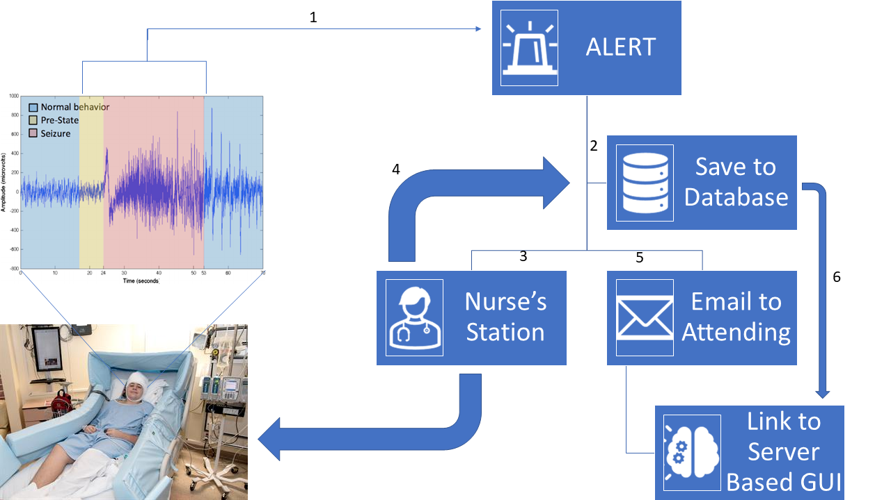

# Sever GUI Client

This Project involved the creation of a database to store patient medical image information, and to access that database via and easy to use client side graphic user interface.

Please refer to the `project_assignment.md` file for a description of the problem assignment. 

Please refer to [This Link](https://github.com/dward2/BME547/blob/main/Lectures/sphinx.md) for how to use sphinx 

[Link to Repository](https://github.com/BME547-Fall2021/final-project-richardson-reyes)

## _Big Picture Design_:

1. A client sends EEG data (binary file data format) via a POST request to a server, which raises an alert on the server

2. The server stores this data on the database

3. The server sends an alert as a server-side post request to a Nurse's station, 

4. This alert will pop up a GUI where the nurse can confirm that they have attended to the patient, and store any qualitative notes on the server

5. The server will send an email (server-side post request) to that patient's attending physician

6. The email contains a link to a GUI (stored on the server, accessed via GET request) containing a 3D rendered image of the brain which will allow the attending to click on and identify the significant electrodes. The selected electrode IDs will be stored on the server to be accessed later for when the seizure location is being determined

   1. Components of this GUI will be imported from this workflow: https://mne.tools/stable/auto_tutorials/clinical/10_ieeg_localize.html#marking-the-location-of-each-electrode-contact

## _Demonstration:_

## _Server URL:_ 
`<IP Address of your server device>` (may be just `localhost` for testing purposes)
## _Github Work:_
* Go to github repository
* Clone repository SSH file 
## _Bash Window:_
* Enter desired folder
* Type git clone (file link)
## _Pre-Work:_
* cd in to the git repository
* Create the relevant python environment using:
### _Anaconda:_
Run the command `conda env create --file=envs/environment.yml --name=<desired env name>`
### _pipenv:_
run the commands:
* `python -m venv <desired env name>`
* `source env/bin/activate`
* `pip install -r envs/requirements.txt`
## _To run the server locally (optional):_
* `python server.py`
## _To run the GUI Client:_
* `python GUI_client.py`
  * If you want to run the GUI to respond to a local server, edit line 16 of GUI_client.py to `http://127.0.0.1:5000`
## _Server API:_
1) POST request: "/new_patient"
    * Sends patient data to the database in the form of a dictionary. It is required to have the key "patient_id", but may also contain "patient_name", "image", and "hr".
2) GET request: "/get"
    * Returns a dictionary of dictionaries. The top level dictionary has keys corresponding to the MRNs present on the database. The values correspond to the data existing on the database pertaining to that MRN. This does not include the b64 image strings.
3) GET request: "/get/<mrn_or_name>"
    * Returns a dictionary of the data pertaining to the MRN or name given in the url. If there is more than one MRN associated with the name given, then the most recent mrn is returned, and other data can only be retrieved by inputting the mrn of the older data. This data does __not__ include the b64 image strings
4) GET request: "/get/<mrn_or_name>/image"
    * Returns a html page as a string. When accessed from the web, it renders the ECG image trace onto the screen. If there is a name associated with the image, that will also be displayed above the image.
## _Database:_
The database is a class which inherits the properties of a list of dictionaries. It also has two extra methods and an attribute per key of the internal dictionaries. Each key attribute is a list of the values of those keys. The add_entry method is a wrapper for the append method that also appends the key values to the attributes. The search method returns the Database with only the dictionaries whose key values match the requested key values. The database can also be initially set with an index key, which is a key that cannot have any duplicate values. Any data appended to the database with an index value matching one in the database will overwrite that entry. The database itself is stored locally in memory on the server. For the purposes of this server, the index key is the patient ID/MRN.
## _GUI Manual:_
1) __Name Box:__ The place where you may enter the patient's name. This box is not required
2) __ID Box:__ The place where you may enter the patient's ID number/MRN. This box is required
3) __Local File Box:__ The place where the csv file location is displayed. You may enter a path in, but the ECG image will not load unless the 'Browse' button is selected.
4) __Server File Dropdown Box:__ The place where you may select the MRN of the patient you wish to retrieve from the database. Will only show MRNs populated on the server database.
5) __Browse Button:__ Browse local files using the local file browser. Will only work if you open a csv file. Will print an error to the GUI if you select another file type. If a compatible csv is detected, then the gui will plot and display the image onto the center of the GUI. 
   1) Example data files can be found in the 'test_data' folder
   2) The average heart rate will be displayed above the image if one is plotted
6) __Send Button:__ Sends all data visible on the GUI (name, id, image, heart rate) to the server. The only required data in order to successfully send to the database is the ID. If you send data to the server, and that ID already exists on the server, then that file will be updated with the new information you send it.
7) __Retrieve Button:__ Retrieves and displays all data stored on server corresponding with the MRN/ID selected from the dropdown box.
8) __Cancel Button:__ Closes the window
9) __Clear Button:__ Clears all data from the GUI
## _License:_
MIT License

Copyright (c) [2021] [Earle-Richardson]

Permission is hereby granted, free of charge, to any person obtaining a copy
of this software and associated documentation files (the "Software"), to deal
in the Software without restriction, including without limitation the rights
to use, copy, modify, merge, publish, distribute, sublicense, and/or sell
copies of the Software, and to permit persons to whom the Software is
furnished to do so, subject to the following conditions:

The above copyright notice and this permission notice shall be included in all
copies or substantial portions of the Software.

THE SOFTWARE IS PROVIDED "AS IS", WITHOUT WARRANTY OF ANY KIND, EXPRESS OR
IMPLIED, INCLUDING BUT NOT LIMITED TO THE WARRANTIES OF MERCHANTABILITY,
FITNESS FOR A PARTICULAR PURPOSE AND NONINFRINGEMENT. IN NO EVENT SHALL THE
AUTHORS OR COPYRIGHT HOLDERS BE LIABLE FOR ANY CLAIM, DAMAGES OR OTHER
LIABILITY, WHETHER IN AN ACTION OF CONTRACT, TORT OR OTHERWISE, ARISING FROM,
OUT OF OR IN CONNECTION WITH THE SOFTWARE OR THE USE OR OTHER DEALINGS IN THE
SOFTWARE.
